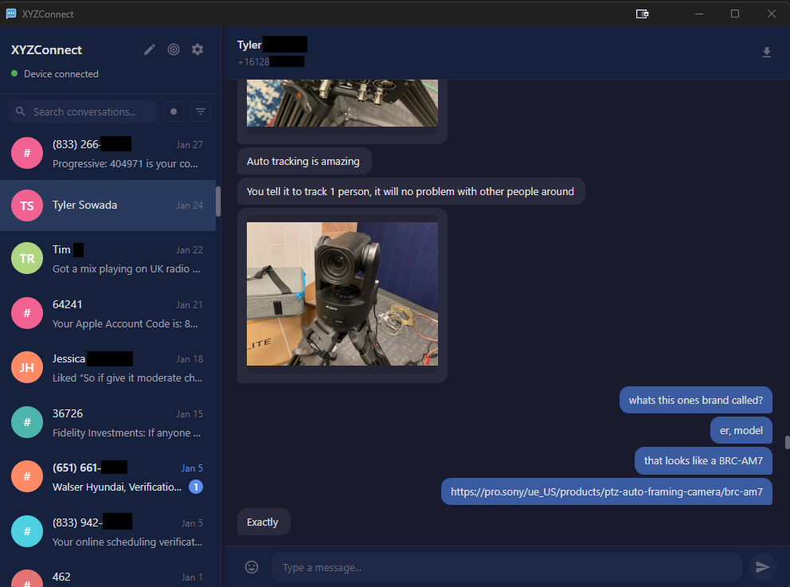

<h1 align="center">XYZConnect</h1>

<p align="center">A free and open source desktop SMS/MMS client for Android, powered by the KDE Connect protocol.<br>Send and receive text messages from your computer over your local network — no cloud, no account, no phone number sharing.</p>

<p align="center">
  <a href="docs/screenshot.png"></a>
</p>

<p align="center">The primary motivation for this app was to make the pain of dealing with SMS 2FA codes easier to deal with, and the project snowballed into a full SMS client to replace Microsoft Phone Link and similar with an open source solution.</p>

## Features

- **Send and receive SMS** — Full two-way texting from your desktop
- **View and save MMS** — Photos, videos, and audio arrive automatically with transcoding for browser-compatible playback
- **Contact sync** — Names pulled from your phone's contacts
- **Spam filter** — Hides unknown senders and short codes; surfaces verification messages
- **One-click verification codes** — Copy 2FA codes from messages with a single click
- **Unread filter** — Quickly see only conversations with new messages
- **Desktop notifications** — Get notified of new messages with taskbar flash (Windows)
- **Cross-platform** — Windows installer, Linux AppImage and .deb, macOS DMG
- **Local network only** — All communication stays on your LAN. Nothing leaves your network.
- **Image lightbox** — Click to view full-size images and videos with right-click save
- **Search** — Filter conversations by contact name or phone number

## How It Works

XYZConnect implements the [KDE Connect](https://kdeconnect.kde.org/) protocol to communicate directly with the KDE Connect Android app over your local network. Your phone and computer discover each other via UDP broadcast, establish an encrypted TLS connection, and exchange messages peer-to-peer. No internet connection is required after initial setup.

## What Makes It Different

Most desktop SMS solutions require cloud relay services, Google accounts, or proprietary apps. XYZConnect is:

- **Fully local** — Messages never leave your network. No cloud, no relay servers, no accounts.
- **Free and open source** — Licensed under GNU GPL v2/v3, the same as KDE Connect itself.

## Getting Started

1. Install [KDE Connect](https://play.google.com/store/apps/details?id=org.kde.kdeconnect_tp) on your Android phone
2. Install XYZConnect on your computer (see [Releases](https://github.com/hansonxyz/xyzconnect/releases) or build from source)
3. Ensure both devices are on the same local network
4. Pair when prompted — that's it

## Downloads

Pre-built installers are available from the [latest release](https://github.com/hansonxyz/xyzconnect/releases/latest):

- **Windows** — [XYZConnect Setup (.exe)](https://github.com/hansonxyz/xyzconnect/releases/latest/download/XYZConnect.Setup.0.1.0.exe)
- **Linux** — [AppImage](https://github.com/hansonxyz/xyzconnect/releases/latest/download/XYZConnect-0.1.0.AppImage) | [.deb](https://github.com/hansonxyz/xyzconnect/releases/latest/download/xyzconnect-gui_0.1.0_amd64.deb)
- **macOS** — Coming soon

## Building From Source

See [BUILD.md](BUILD.md) for prerequisites and build instructions.

Quick start:

```bash
# Install dependencies
npm install
cd gui && npm install

# Dev build (Windows, unpacked)
npm run build:win

# Release installer
npm run release:win    # Windows
npm run release:linux  # Linux
npm run release:mac    # macOS
```

## Tech Stack

- **Electron** + **Svelte 5** — Desktop UI with reactive components
- **TypeScript** — Strict mode throughout
- **better-sqlite3** — Local message and contact database
- **Pino** — Structured logging
- **FFmpeg** — Video transcoding and thumbnail generation (bundled)

## Project Structure

| Path | Description |
|------|-------------|
| `src/` | Daemon: protocol, networking, database, IPC |
| `gui/` | Electron app: main process, preload, Svelte renderer |
| `tests/` | Unit and integration tests (Vitest) |
| `docs/` | Architecture docs and development log |
| `BUILD.md` | Build prerequisites and instructions |
| `CONTRIB.md` | Credits and third-party attribution |
| `LICENSE` | GNU GPL v2/v3 dual license |

## Current Limitations

- MMS send is not yet implemented (Android companion app limitation)
- macOS DMG not yet available (I need a mac to do this)

## License

Dual-licensed under [GNU GPL v2](licenses/GPL-2.0.txt) and [GNU GPL v3](licenses/GPL-3.0.txt), matching KDE Connect.

## Acknowledgments

See [CONTRIB.md](CONTRIB.md) for full attribution. Key dependencies include KDE Connect (protocol), Electron, Svelte, FFmpeg, and better-sqlite3.
